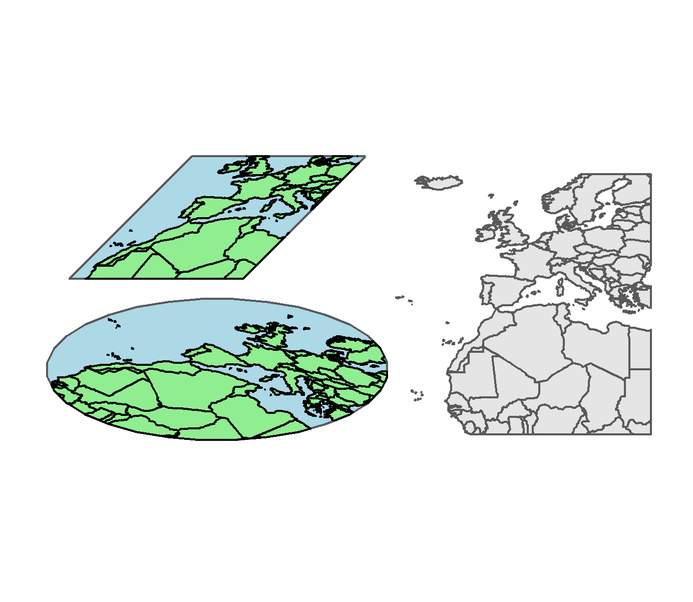

## sfRotate

R package to rotate sf objects based on the [Urban Demographics blog](https://www.urbandemographics.org/post/figures-map-layers-r/). The formula is from [Stefan Jünger](https://stefanjuenger.github.io/gesis-workshop-geospatial-techniques-R/slides/2_4_Advanced_Maps_II/2_4_Advanced_Maps_II.html#11).

The package contains additional functions to crop sf objects and convert points from geometry objects.

### Installation
This package should be installable with:
```{r}
devtools::install_github("wtumber/sfRotate")
```

### Example outputs
This is a combined example output using the functions from this packages. The map data is provided as an sf geometry object from the `rnaturalearth` package.
 

### Future development
*Create a [git submodule](https://git-scm.com/book/en/v2/Git-Tools-Submodules) where matrix transformations can be represented in a shiny app.
