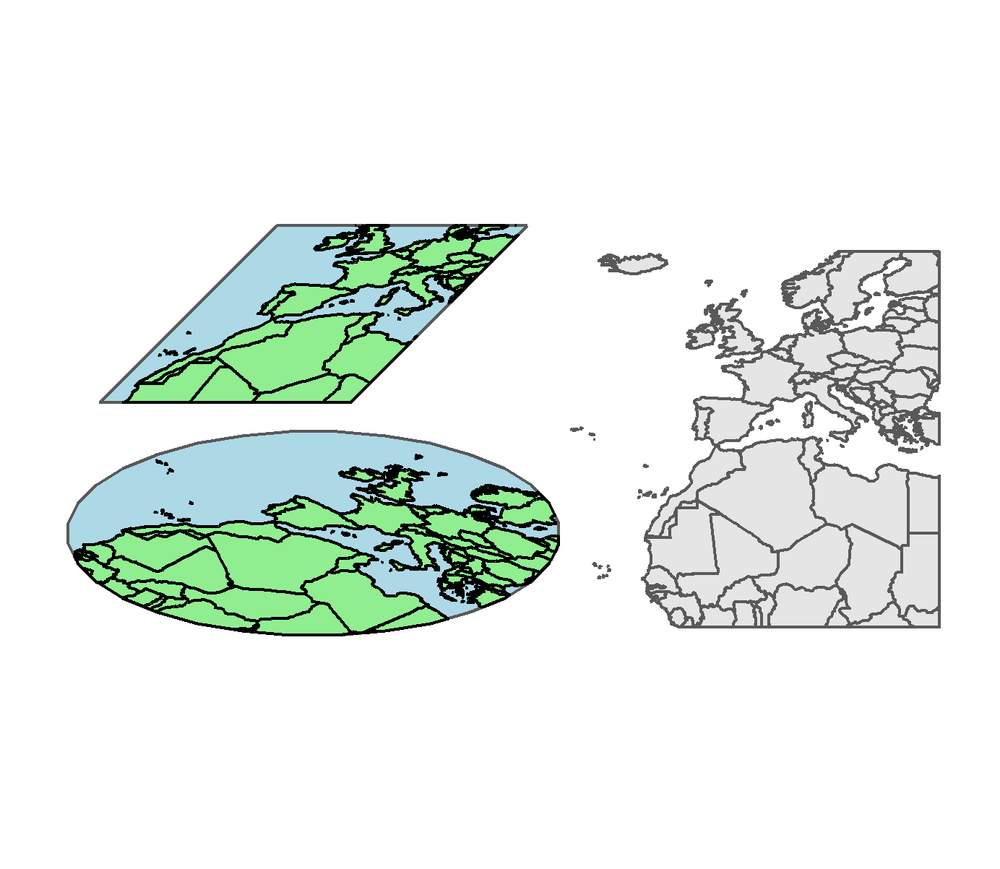

## sfRotate

R package to rotate sf objects based on the [Urban Demographics blog](https://www.urbandemographics.org/post/figures-map-layers-r/). The formula is from [Stefan Jünger](https://stefanjuenger.github.io/gesis-workshop-geospatial-techniques-R/slides/2_4_Advanced_Maps_II/2_4_Advanced_Maps_II.html#11).

### Example outputs
This is a combined example output using the functions from this packages.
 

