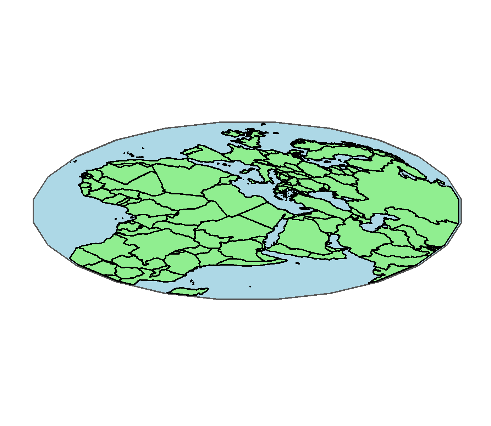

## sfRotate

R package to rotate sf objects based on the [Urban Demographics blog](https://www.urbandemographics.org/post/figures-map-layers-r/). The formula is from [Stefan Jünger](https://stefanjuenger.github.io/gesis-workshop-geospatial-techniques-R/slides/2_4_Advanced_Maps_II/2_4_Advanced_Maps_II.html#11).

### Example outputs
 

 

### IN PROGRESS
TODO: 
* Fix issues where the boundary and the sf shape do not match on x- axis.
* Check package works with -ve x,y values.
* work out the flow for using square and circular boundaries in the same plot.
